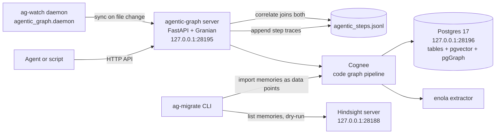

# Architecture

agentic-graph turns a repository into a queryable code graph and records agent steps next to it. Cognee drives the indexing. Postgres stores everything. A small HTTP (Hypertext Transfer Protocol) server exposes search, tracing, and memory endpoints.

This document explains how the pieces fit together. For install and usage steps, see the [README](../README.md).

## Components

- `agentic_graph/server.py`. The FastAPI app, served by Granian with uvloop. Binds to `127.0.0.1:28195` by default. Runs Cognee migrations at startup, then sets up the default dataset.
- `agentic_graph/daemon.py`. The `ag-watch` daemon. Watches a repository with watchdog and re-syncs it through the server after each change.
- `agentic_graph/client.py`. A synchronous HTTP client for the server endpoints. The daemon and any script can call it.
- `agentic_graph/cognee_adapters/agentic_pggraph.py`. `AgenticPgGraphAdapter`, a custom Cognee graph adapter backed by Postgres and pgGraph. See [the adapter section](#agenticpggraphadapter).
- `agentic_graph/cli/migrate.py`. The `ag-migrate` CLI (command line interface). Moves memories from a Hindsight server into Cognee. See [Hindsight migration](#hindsight-migration).

## Data flow

A sync runs through these steps.

1. A client sends `POST /sync` with `repo_path`. With `force` set, the server prunes Cognee data and system state first, then re-runs setup.
2. The server runs Cognee's code graph pipeline on the repository. The dataset name comes from `COGNEE_DATASET`, which defaults to `agentic_graph`.
3. enola extracts modules, symbols, and their relations from source files. Its cache lives in `.enola/` inside the watched repository.
4. Cognee writes the extracted facts as graph nodes and edges through `AgenticPgGraphAdapter`. Plain Postgres tables hold the data. A pgGraph index per schema lets traversal use pgGraph functions.
5. fastembed computes embeddings locally with `BAAI/bge-small-en-v1.5`. The vectors land in Postgres through pgvector.
6. Every search endpoint queries the same Postgres instance. No other datastore is involved.

The daemon adds a loop around step 1. It queues one forced full sync at startup, then debounces file change events for 2 seconds by default and queues an incremental sync. A worker thread drains the queue and calls the server through `agentic_graph.client`. It ignores `.git`, `.venv`, `.cognee_data`, `.cognee_system`, `.enola`, `__pycache__`, `node_modules`, and cache directories, plus any file without a known source suffix.

## HTTP API

| Method | Path | Request fields | What it does |
|---|---|---|---|
| GET | `/health` | none | Liveness check. |
| POST | `/sync` | `repo_path`, `force` | Index a repository. `force` prunes first. |
| POST | `/search` | `query`, `scope`, `limit` | Search code facts, Hindsight memories, or both. `scope` is `code` (default), `memory`, or `all`. |
| POST | `/explore` | `target`, `direction`, `depth` | Find a symbol by name, then traverse its callers or callees up to `depth` hops. |
| POST | `/trace` | `step_id`, `tool`, `args`, `result`, `touched_files`, `touched_symbols`, `parent_step_id` | Append one agent step to the trace file. Returns the `step_id`, generated when omitted. |
| POST | `/correlate` | `target`, `scope`, `limit` | Join code facts, Hindsight memories, and agent traces for a target. `scope` is `code`, `memory`, or `all` (default). |
| POST | `/api/v1/remember` | `data`, `dataset_name`, `node_set` | Store text in Cognee memory. Runs in the background. |
| POST | `/api/v1/recall` | `query`, `dataset_name`, `node_set`, `top_k` | Search stored memories with auto-routed summary search. |

## Step tracing and correlation

`POST /trace` appends one JSON (JavaScript Object Notation) object per line to `COGNEE_STEPS_FILE`, which defaults to `.cognee_data/agentic_steps.jsonl`. Each step records the tool, its arguments, the result, and the files and symbols it touched. The `parent_step_id` field links steps into a tree, so one root step can carry a whole run.

`POST /correlate` answers what the code, the memories, and the traces say about a given target. It runs a code fact query and a semantic Hindsight memory search for the target, then scans the trace file for steps whose `touched_files`, `touched_symbols`, `tool`, or `result` contain the target string. The response returns the lists under `code_results`, `memory_results`, and `traces`.

## AgenticPgGraphAdapter

Cognee defines a graph database interface and ships a Postgres option, `PostgresDemoAdapter`, that stores nodes and edges in plain tables. `AgenticPgGraphAdapter` in `agentic_graph/cognee_adapters/agentic_pggraph.py` extends it and registers a pgGraph graph index for each schema, so graph traversal runs through pgGraph SQL (Structured Query Language) functions instead of recursive joins.

`server.py` registers the adapter under the name `agentic_pggraph` at import time, before the FastAPI app is built. The environment variable `GRAPH_DATABASE_PROVIDER=agentic_pggraph` selects it.

The payoff is operational. One Postgres process serves relational tables, vectors, cache, and the graph. No Neo4j instance, and no Java process, is needed.

## Ports

| Port | Service | Bind |
|---|---|---|
| 28195 | agentic-graph HTTP API | `127.0.0.1` |
| 28196 | Postgres 17, mapped to 5432 inside the container | `127.0.0.1` |
| 28188 | Hindsight memory server, the migration source | `127.0.0.1` |

Every service binds to loopback. Use a tunnel such as Tailscale when another machine needs access.

## Environment variables

Copy `.env.example` to `.env` and fill in real values. The server loads it from the working directory at startup.

| Variable | Default in `.env.example` | Purpose |
|---|---|---|
| `TELEMETRY_DISABLED` | `true` | Turn off Cognee usage telemetry. |
| `DATA_ROOT_DIRECTORY` | absolute path | Datasets, embeddings, and the step trace file. |
| `SYSTEM_ROOT_DIRECTORY` | absolute path | Cognee system state. |
| `LOG_LEVEL` | `ERROR` | Cognee log level. |
| `COGNEE_SERVER_URL` | `http://127.0.0.1:28195` | Server base URL for `agentic_graph.client` and `ag-watch`. |
| `LLM_PROVIDER` | `custom` | LLM (large language model) provider type. `custom` covers OpenAI-compatible endpoints. |
| `LLM_ENDPOINT` | placeholder | Chat completions endpoint URL. |
| `LLM_MODEL` | placeholder | Model name served by the endpoint. |
| `EMBEDDING_PROVIDER` | `fastembed` | Embedding backend. `fastembed` runs locally. |
| `EMBEDDING_MODEL` | `BAAI/bge-small-en-v1.5` | Local embedding model. |
| `COGNEE_SKIP_CONNECTION_TEST` | `true` | Skip the LLM connection test at startup. |
| `LLM_API_KEY` | placeholder, secret | API key for `LLM_ENDPOINT`. |
| `DB_PROVIDER` | `postgres` | Relational database engine. |
| `DB_HOST` | `127.0.0.1` | Postgres host. |
| `DB_PORT` | `28196` | Postgres port on the host. |
| `DB_USERNAME` | `cognee` | Postgres user, matches `docker-compose.yml`. |
| `DB_PASSWORD` | `cognee` | Postgres password, matches `docker-compose.yml`. |
| `DB_NAME` | `cognee_db` | Postgres database, matches `docker-compose.yml`. |
| `VECTOR_DB_PROVIDER` | `pgvector` | Vector store engine. |
| `CACHE_BACKEND` | `postgres` | Cache backend. |
| `GRAPH_DATABASE_PROVIDER` | `agentic_pggraph` | Graph engine. Selects the custom adapter. |
| `ENABLE_BACKEND_ACCESS_CONTROL` | `false` | Backend access control, off for plain local Postgres. |
| `ENOLA_PATH` | absolute path | enola extractor binary. |
| `DATABASE_CONNECT_ARGS` | `'{"ssl": false}'` | Extra SQLAlchemy connect arguments as JSON. |
| `COGNEE_HOST` | `127.0.0.1` | Bind host for `ag-server`. |
| `COGNEE_PORT` | `28195` | Bind port for `ag-server`. |
| `COGNEE_DATASET` | `agentic_graph` | Dataset used by sync and search endpoints. |
| `COGNEE_STEPS_FILE` | `.cognee_data/agentic_steps.jsonl` | Trace file for `/trace` and `/correlate`. |
| `COGNEE_TIMEOUT` | `300` | Client HTTP timeout in seconds. |
| `HINDSIGHT_API_URL` | `http://127.0.0.1:28188` | Hindsight base URL for `ag-migrate`. |
| `HINDSIGHT_API_TOKEN` | empty, secret | Hindsight bearer token for `ag-migrate`. |
| `CODE_GRAPH_REPO_PATH` | current directory | Repository path for scripts that run without an argument. |

## Storage directories

- `.cognee_data/`. Cognee datasets, embeddings, and `agentic_steps.jsonl`.
- `.cognee_system/`. Cognee system state.
- `.enola/`. enola extraction cache. Delete it to force a full re-extraction on the next sync.

All three are gitignored.

## Hindsight migration

`ag-migrate` moves memories from a Hindsight server into a Cognee dataset. It runs in two modes.

Dry run is the default. It fetches a sample from one bank and prints the reported total, unique tags, a fact type histogram, and a table of memories. Nothing is written.

Import runs without `--dry-run`. The command pages through the whole bank, converts each memory into a `HindsightMemory` data point from `agentic_graph/hindsight.py`, and writes batches through Cognee's `add_data_points`. The data point keeps the Hindsight fields, uses `hindsight_id` as its identity, and joins the `hindsight` node set. The `--fact-type` and `--since` flags filter what imports. After every batch the command saves a checkpoint to `hindsight_migration_checkpoint.json` under `DATA_ROOT_DIRECTORY`, and `--resume` restarts from it.

Imported memories land in the `hindsight` dataset by default. `POST /api/v1/recall` with `"dataset_name": "hindsight"` searches them next to the code graph.
